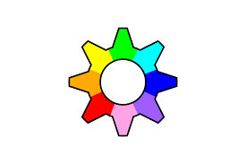

# What is GNU+Linux?
(You need to write something here)
# 3 Reasons to use GNU+Linux:
* Reason 1 (You need to write something here)
* Reason 2 (You need to write something here)
* Reason 3 (You need to write something here)

# Other operating systems
* **Microsoft Windows** is a group of several proprietary graphical operating system families, all of which are developed and marketed by Microsoft. 

* **macOS** is a series of proprietary graphical operating systems developed and marketed by Apple Inc. 

* **FreeBSD** is a free and open-source Unix-like operating system descended from the Berkeley Software Distribution (BSD), which was based on Research Unix.

RISC OS** is a computer operating system originally designed by Acorn Computers Ltd in Cambridge, England. 

